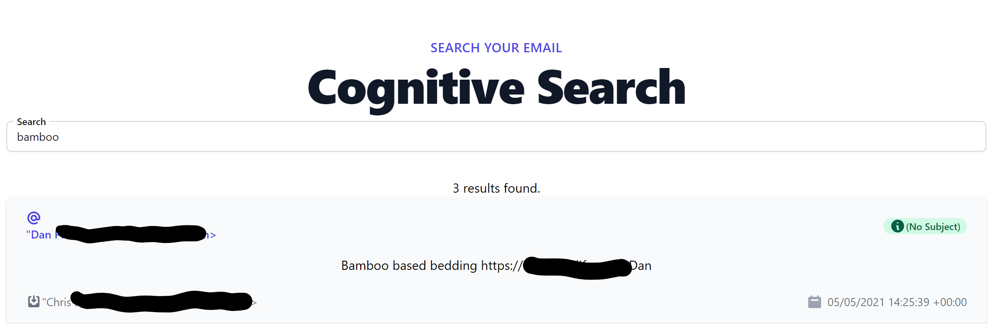

# cogsearch-mbox
[](http://commitizen.github.io/cz-cli/)   

## Overview
> Ingest .mbox files into Azure Cognitive Search, and search them online.

Email providers allow you to export the emails that you hold with them - the .mbox format is used by [Google](https://support.google.com/accounts/answer/3024190?hl=en), [ProtonMail](https://protonmail.com/support/knowledge-base/whats-the-difference-between-eml-and-mbox/), [hey.com](https://www.hey.com/faqs/#if-i-don-t-like-hey-can-i-export-my-email-and-contacts), and [Apple Mail](https://support.apple.com/en-gb/guide/mail/mlhlp1030/mac) for example. *But*, whilst there are plenty of desktop viewers for these formats, it's not convenient to read historic mailboxes on the go, on your mobile phone for example. If you have moved across many email services, chances are, you might have some emails you want to read. This tool ingests your emails, and then makes them to search.

Right now you can:
- Ingest emails into [Azure Cognitive Search](https://docs.microsoft.com/en-us/azure/search/search-what-is-azure-search?WT.mc_id=AI-MVP-5004204)
- Search your emails using a [Blazor-based web application](https://docs.microsoft.com/en-us/aspnet/core/blazor/hosting-models?view=aspnetcore-5.0&WT.mc_id=AI-MVP-5004204)

**Do not deploy this without adding authentication and login in front of the applcication.**

Features I'd like to add:
- [Cognitive search faceting](https://docs.microsoft.com/en-us/azure/search/tutorial-csharp-facets?&WT.mc_id=AI-MVP-500420) to click on an email, and see other emails from that person
- A web UI to drag your mbox file onto for upload
- Date based search
- [Semantic search](https://docs.microsoft.com/en-us/azure/search/semantic-search-overview?&WT.mc_id=AI-MVP-500420) to allow for natural language questions, to find information in your emails
- Ingestion of email attachments, including PDFs and images with [AI enrichment](https://docs.microsoft.com/en-us/azure/search/cognitive-search-concept-intro?&WT.mc_id=AI-MVP-500420) to search text in email attachments
- [Autosuggest as you type](https://docs.microsoft.com/en-us/azure/search/tutorial-csharp-type-ahead-and-suggestions?&WT.mc_id=AI-MVP-500420)
- [Infrastructure as code in Bicep](https://docs.microsoft.com/en-us/azure/azure-resource-manager/bicep/overview?&WT.mc_id=AI-MVP-500420)

cogsearch-mbox is available under the [MIT Licence](./LICENCE) and I welcome issues and pull requests!



## Getting started
You can use a [dev container](https://docs.microsoft.com/en-us/azure-sphere/app-development/container-build-vscode?&WT.mc_id=AI-MVP-500420) to run this in VS Code, or in [GitHub codespaces](https://github.com/features/codespaces).

### Cloud Resources
You'll need to deploy an [Azure Cognitive Search](https://docs.microsoft.com/en-us/azure/search/search-what-is-azure-search?WT.mc_id=AI-MVP-5004204) resource; and an Azure App Service if you want to host this. Right now, the [Bicep file](https://docs.microsoft.com/en-us/azure/azure-resource-manager/bicep/overview?&WT.mc_id=AI-MVP-500420) is not complete.

### Ingestion
You'll need an environment with Python 3.9 set up. You

1. Create a Python virtual environment and install all required dependencies.
```
cd ingest
python3 -m venv .venv
source .venv/bin/activate
pip install -r requirements-dev.txt
```

2. Update the `.env.example` file with your API keys, the search index you want to name, the path to your .mbox file, and the service endpoint.

3. Rename the `.env.example` file to `.env`

3. Run `python3 ingest.py` and you should see an index created with the relevant emails.


## Web Application
1. Install required NPM packages
```
cd webapp
npm install
```

2. Update the `.appsettings.Development.json` file with your API keys, the search index you want to name, and the service endpoint.

3. Rename this file `.appsettings.json`

4. In VS Code, you can run and debug the application to test out the search functionality, or run `dotnet run` at the terminal. Enjoy!

## Contact
Feel free to contact me [on Twitter](https://twitter.com/sealjay_clj). For bugs, please [raise an issue on GitHub](https://github.com/Sealjay/cogsearch-mbox/issues).

## Contributing
Contributions are more than welcome! This repository uses [GitHub flow](https://guides.github.com/introduction/flow/) - with [Commitizen](https://github.com/commitizen/cz-cli#making-your-repo-commitizen-friendly) [semantic commits](https://nitayneeman.com/posts/understanding-semantic-commit-messages-using-git-and-angular/#common-types) (`npm install -g commitizen cz-customizable` and then `git cz`- easy to setup!)